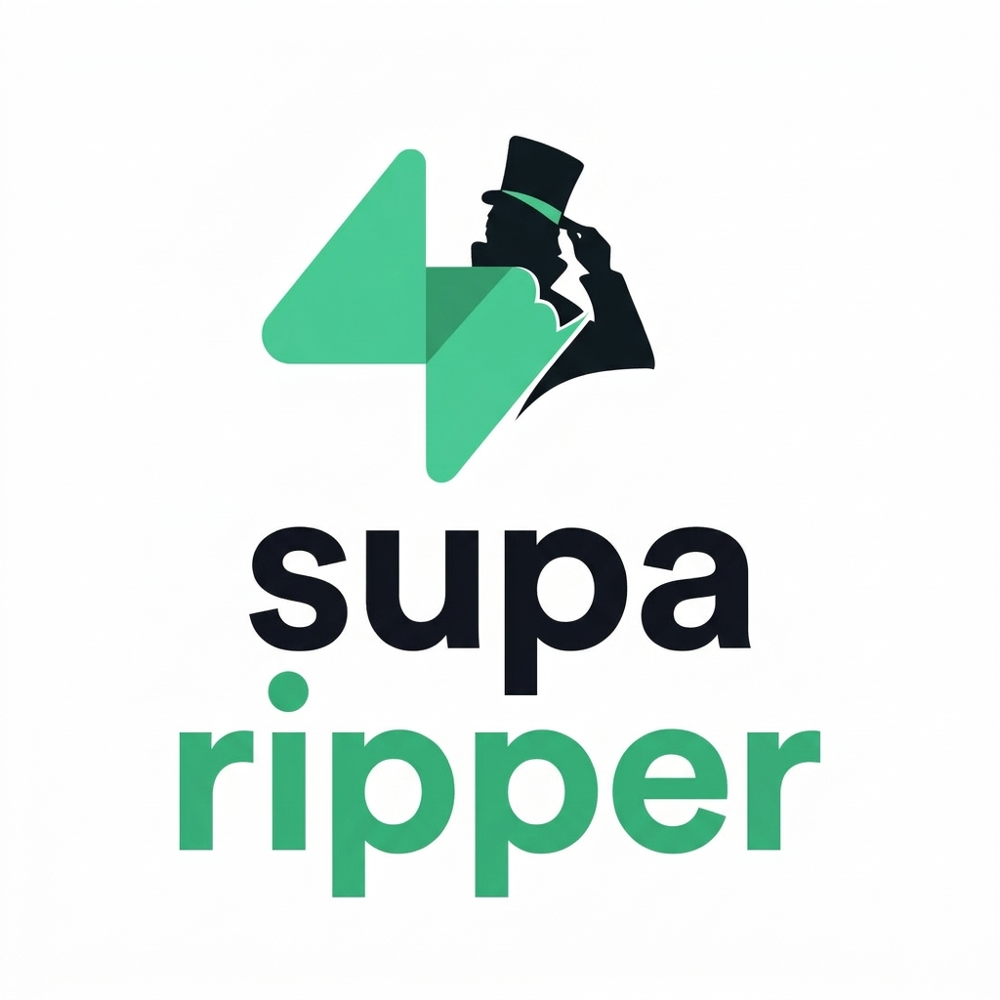

# SupaRipper 🏴‍☠️

<p align="center">
  
</p>

## Because Vibe Coding is cool, but RLS is "hard"

Let's be honest: in the era of **Vibe Coding**, everyone is shipping Supabase apps at the speed of sound. But sometimes, in the middle of all that *vibrating*, someone forgets to toggle that tiny little "Enable Row Level Security" switch. 

Oops. 

**SupaRipper** is a lightweight Bash script designed to audit (or... rip?) data from Supabase instances that were built with more "vibes" than "security". If a project has wide-open tables or anonymous registration enabled, this tool will find it.

## 🚀 Features

- **Open Registration Check**: Finds out if literally anyone can join the party. 
- **Credential Testing**: Optionally test with your own email/password pairs.
- **Schema Discovery**: Automatically fetches the OpenAPI definitions because, hey, transparency is good, right?
- **Automated CRUD Audit**:
    - **GET**: "Can I see your secret data?" (Spoiler: often yes).
    - **POST**: "Can I add myself as an admin?"
    - **PATCH**: "Can I change the prices of everything to $0?"
    - **DELETE**: "Can I just... delete your whole database?"
- **JSON Reports**: All findings are neatly saved into `.json` files so you can enjoy the chaos in a structured format.

## 🛠️ Usage

Make sure you have `curl` and `jq` installed (if you don't, are you even coding?).

```bash
chmod +x suparipper.sh
./suparipper.sh -u https://vibe-check.supabase.co -k your_anon_key -b your_user_jwt
```

### Options:
- `-u`: The Supabase URL (mandatory).
- `-k`: The API Key / Anon Key (mandatory).
- `-b`: Custom Bearer Token / User JWT (optional, defaults to API Key).
- `-e`: Custom email for registration testing (optional).
- `-p`: Custom password for registration testing (optional).

## ⚠️ Disclaimer

This tool is for **educational and authorized security auditing purposes only**. Don't be a dick. Only use it on projects you own or have explicit permission to test. If you find a vulnerability in a someone's Vibe App, be a bro and tell them to turn on RLS.

---
*Built with ❤️ (and potentially some lack of sleep) for nicolas.*
